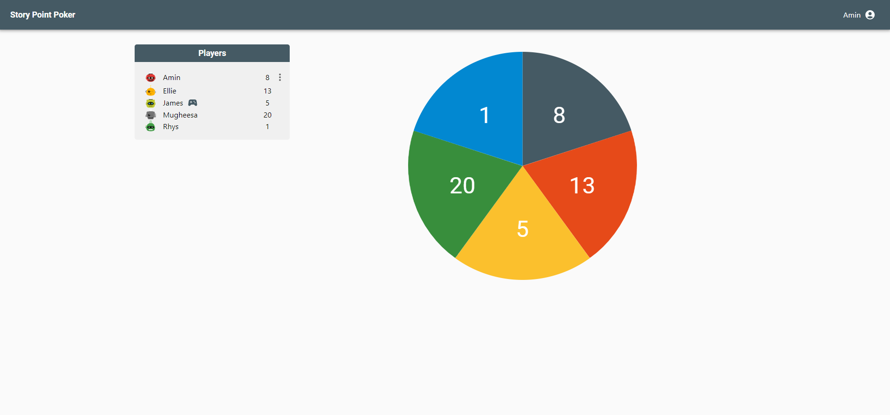
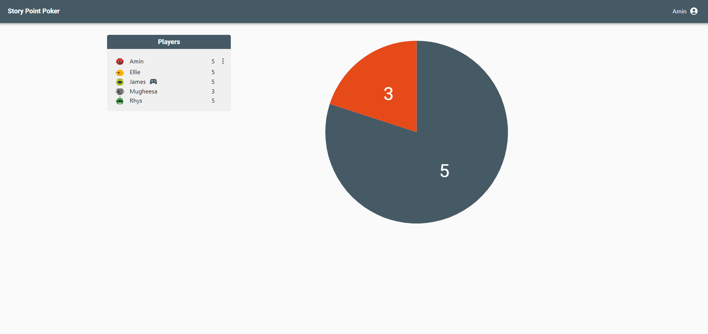
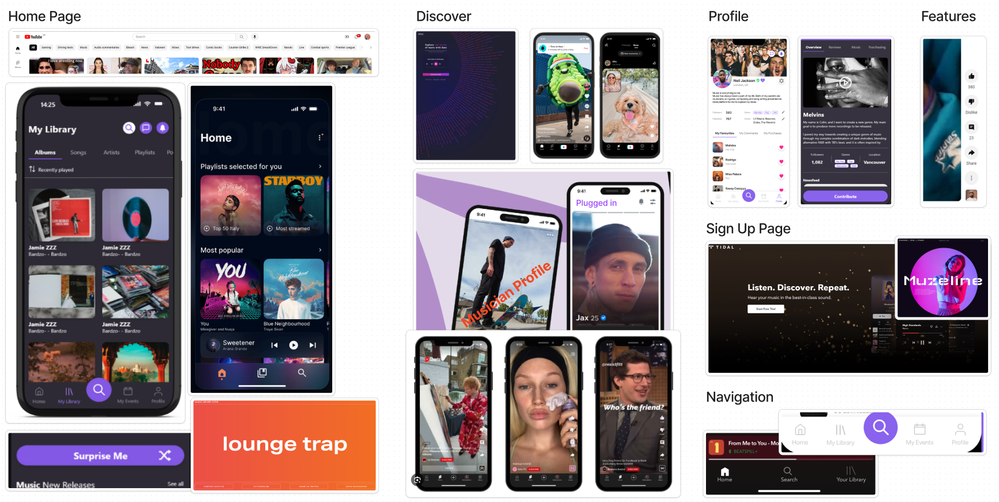
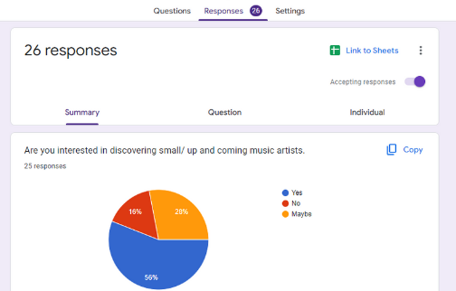
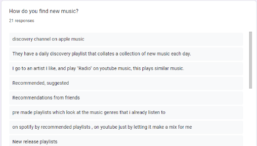
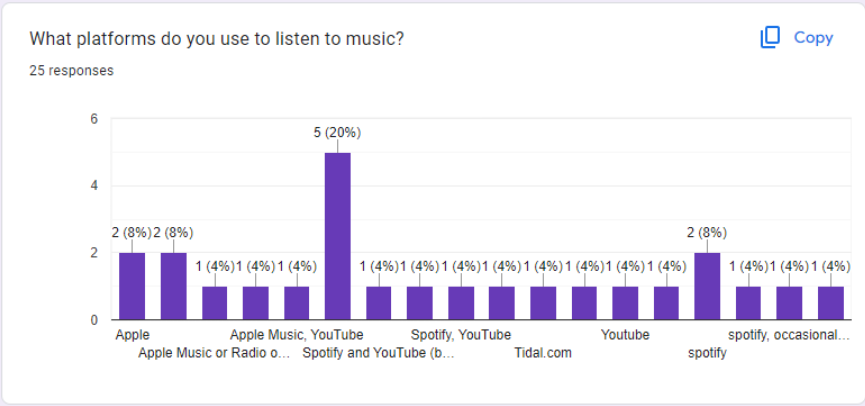
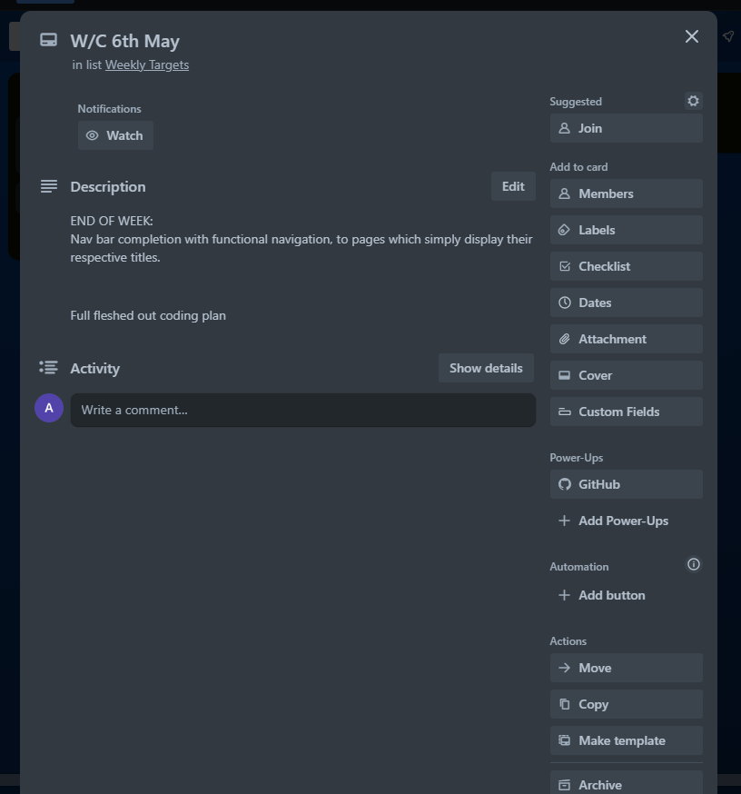
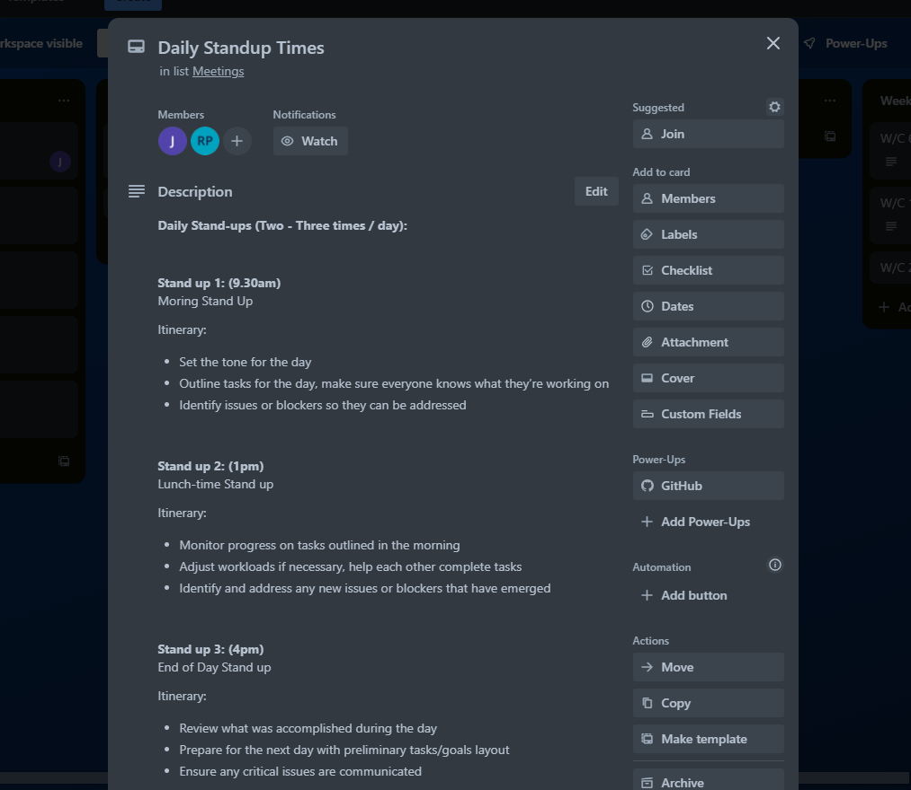
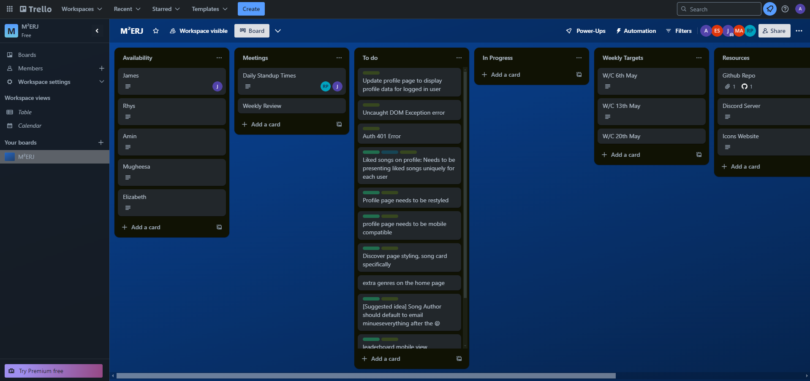

<small>*Click the banner to checkout our app*</small>

## Authors
<a href="https://www.linkedin.com/in/james-hearn-73769493/" style="color: white; text-decoration: underline"><strong>James Hearn</strong></a> · 
**Elizabeth Salami** · 
**Mohamedamin Abdile** · 
**Rhys Postans** · 
**Mugheesa Ahmed**

## 📋 Contents

- <a href="#Problem-Statement" style="color: #8962ed; text-decoration: underline;">Problem Statement</a>
- <a href="#Solution" style="color: #8962ed; text-decoration: underline;">Solution</a>
- <a href="#Tech-Stack" style="color: #8962ed; text-decoration: underline;">Tech Stack</a>
- <a href="#Problems-faced-and-solutions" style="color: #8962ed; text-decoration: underline;">Problems faced and solutions</a>
- <a href="#Future-scope" style="color: #8962ed; text-decoration: underline;">Future Scope</a>
- <a href="🎉 #Acknowledgments" style="color: #8962ed; text-decoration: underline;">Acknowledgments</a>
- <a href="The-Process" style="color: #8962ed; text-decoration: underline;">The Process</a>

## ⛔ Problem Statement
Emerging artists need a platform that supports engagement, and discovery, enabling artists and fans to build a direct connection for listening, feedback and contribution.

Currently, music platforms are ran by record labels, manipulating recommendation algorithms by saturating the platform with content and paying for it to be prioritised. In addition to this, fans don't have a direct way to contribute towards an artists journey, or feel like they're a part of the growth of their favourite artists.

Longevity in the music industry is built on a foundation of loyalty between artist and their fans, and we believe Plugged-In Music can help to provide that method of communication and collaboration.

## 🔑 Solution
Our solution is a music platform that leverages quick-form content methods to help with the discovery of new music, with tinder controls and functionality. One of our core features, the discovery page, gives users the ability to be presented with random music snippets, along with two buttons allowing them to dislike or like in order to add those songs to their playlist. In addition to creating fast, quality playlists, each "💜" received is tracked and tallied increasing the total count for that artist. This gamification feature fosters competition among artists to increase their like count in order to appear higher on the leaderboard and in turn, gain more exposure.

## 🚀 Future Scope
Due to time constraints we were not able to develop certain features or functionality that we would have liked. For example, during our first stakeholder meeting we were provided an extensive list of social features that would help with artist outreach, such as stories, live streaming, and a contribution or donation system. In addition to these features, monetisation was briefly mentioned in the form of implementing subscription models. As a result we scaled back our mvp to focus on one core discovery feature as a proof of concept and then refining our platform to function and flow as seamless as possible.

<table>
  <tr>
    <th><strong>Feature</strong></th>
    <th><strong>Description</strong></th>
 
  </tr>
  <tr>
    <td>Listening Parties</td>
    <td>Set up a room with your friends to all contribute and listen to the same listening queue / playlist at the same time.</td>
  </tr>
  <tr>
    <td>Live Streaming</td>
    <td>Your favourite artists bringing the electric, passionate atmosphere of concert going live to you from the comfort of your home</td>
  </tr>
  <tr>
    <td>Contributions</td>
    <td>Creating intricate payment systems integrating third party services to accept contributions for artists. Such as studio time, audio equipment, merchandise and more.</td>
  </tr>
  <tr>
    <td>Spotlight</td>
    <td>Recognition for being one of the first few people to discover new up and coming artists, as well as loyalty spotlights for sticking around.</td>
  </tr>
  <tr>
    <td>User Tailored Algorithm(s)</td>
    <td>Tailored recommendation algorithms to display new music that fits your taste in your home feed, but also music from similar genres that might expand your world of music.</td>
  </tr>
</table>

## 🪫 Dependencies / Limitations
- We are using the free / hobby version of Vercel and Supabase. This means we have to succumb to certain limitations, such as storage and bandwidth limits. Whilst this is quickly scalable by switching to premium versions, this must be monitored to ensure there is no downtime and no unexpected expenditure.
- Authentication is extremely complciated and must be secure, so we will be using Supabase's pre-built authentication systems that have proven security methods in place.
- Without contribution systems or unique discovery features, onboarding artists early on may prove difficult.
- Music storage is not only limited by Supabase's subscription plan, but it also presents complications regarding file size and how uploads are handled. For example, Supabase recommends setting up resumable uploads for files above 6Mb. We attempted this using tus-js-client but decided, due to time constraints, it wasn't feasible to continue. Alternatively we setup regular file uploads to a storage bucket, utilising supabase api, with file size limits of 8Mb.

## 💽 Tech Stack

### Core
&nbsp;
&nbsp;
&nbsp;

### Frontend

&nbsp;
&nbsp;

### Backend & Database

&nbsp;
&nbsp;
&nbsp;

### Design & Collaboration

&nbsp;
&nbsp;
&nbsp;

&nbsp;
## ✍️ Lessons Learned

- We found Next.js to be far more efficient and effective to use than vanilla react. The directory based routing allows for cleaner file structure of layouts, pages and components, as well as clean organisation of API routes.
- TailwindCSS allowed us to prototype and style to our wireframes, responsively, with ease.
- Using Supabase to solve our authentication requirements and databasing with Row-Level security took care of one of our most complex problems, within minutes.
- Using mock data was great as it allowed us to address the front end quickly, however, it also caused a bottleneck when we were ready to present real data and the backend wasn't ready.
- Our team worked incredibly well together, utilising pair programming and daily stand ups to keep tasks organised and team members on track.
- Spending the entire first sprint focusing on our team's core values, work processes and methods of conflict resolution allowed us to progress quickly throughout the remaining sprints.
- Meticulously planning our database schema and wireframing our front-end gave us guide rails along the entire development process.
- Conducting market research early helped us to tailor our approach, eliminating any need for trial and error, saving time in the long run.
- Setting up the API early to streamline data fetching and setting empowers the DRY coding principle and allows for tidier code.
- Prioritise your strengths over learning new things (80/20 rule), when faced with a time crunch

- Setting up snapshot tests with Jest is easy, but testing Next.js API routes with Jest and Supertest is exceedingly more difficult
- Utilise mock data for testing in Next.js, rather than trying to setup simulated API environments with Supertest
- 

## The Process

### Decision making with Planning Poker

> Deciding on using TypeScript over JavaScript:

<table>
<tr>
  <td>
  
  **Initial Decision:**  
  *(Higher = Against, Lower = For)*
  </td>
  <td>
  
  **Final Decision**:  
  *after two rounds of dicussion within the team (Majority ended on the same number)*
  </td>
</tr>
<tr>
  <td></td>
  <td></td>
</tr>
</table>

&nbsp;
### Mood Boarding:

> 30 minutes to gather ideas onto the moodboard, 30 minutes to categorise the ideas we like:

<table>
<tr>
  <td>
  
  **Unorganised Moodboard**
  </td>
  <td>

  **Organised Moodboard**
  </td>
</tr>
<tr>
  <td></td>
  <td></td>
</tr>
</table>

&nbsp;
### High and Low Fidelity Wireframing:

> Upon deciding on our tech stack, I put together the high fidelity wireframes over night and brought it to the team in the morning. We then worked on refining them together with low-fidelity wireframes and prototypes.

<table>
<tr>
  <td>
  
  **Low Fidelity Wireframes**
  </td>
  <td>

  **High Fidelity Wireframes**
  </td>
</tr>
<tr>
  <td></td>
  <td></td>
</tr>
</table>

&nbsp;

### User Research and Feedback Forms:
> Utilising google forms we conducted user research and attained critical feedback

<table>
<tr>
  <td colspan="2">
  
  **Results**
  </td>
</tr>
<tr>
  <td></td>
  <td></td>
</tr>
<tr>
  <td colspan="2"></td>
</tr>
</table>

&nbsp;
### Trello | Kanban Planning and Organisation:

<table>
<tr>
  <td>
  
  **Weekly Goals**
  </td>
  <td>

  **Daily Standups**
  </td>
</tr>
<tr>
  <td></td>
  <td></td>
</tr>
<tr>
  <td colspan="2">
  
  **Trello Development Tickets**
  </td>
</tr>
<tr>
  <td colspan="2"></td>
</tr>
</table>

&nbsp;

## Documentation:
- [Our Team Manifesto](https://github.com/moose-hub/PluggedIn/documentation/manifesto.md)
- [Brand Styleguide](https://github.com/moose-hub/PluggedIn/documentation/styleguide.md)

## 🎉 Acknowledgments

### School of Code:

We would like to thank the school of code for making this all possible!

[School of Code Website](https://www.schoolofcode.co.uk) - [School of Code Github](https://github.com/SchoolOfCode)

### Nathan & Nasa (Stakeholders):

A Very big thank you to <a href="https://www.linkedin.com/in/nathan-anderson-5613a6162/">Nathan</a> and Nasa for giving us the trust and opportunity to work on this project.

### Nadeem:

Thank you to <a href="https://www.linkedin.com/in/nadeemshabir/">Nadeem</a> for constanly checking in on us and reminding us of common pitfalls we could run into.

### Our respective Mentors

We also want to express our gratitude towards our mentors for helping us along the way and being that voice in our corner:

<a href="https://www.linkedin.com/search/results/all/?fetchDeterministicClustersOnly=true&heroEntityKey=urn%3Ali%3Afsd_profile%3AACoAACwLBQsBTgfHCqQtaf1fA--CukPS6rfSfgg&keywords=guy%20dunton&origin=RICH_QUERY_SUGGESTION&position=0&searchId=ce3b62f9-0615-4098-b112-e9583516e62c&sid=bhi&spellCorrectionEnabled=false">Guy Dunton</a> · 
<a href="https://www.linkedin.com/in/azlancuttilan/">Azlan Cuttilan</a> · 
<a href="https://www.linkedin.com/in/bashley1/">Ben Ashley</a> · 
<a href="https://www.linkedin.com/in/fitzpatrickandrew/">Andrew Fitzpatrick</a>
